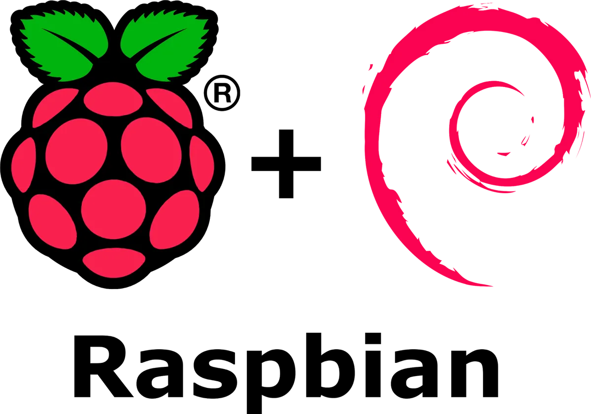
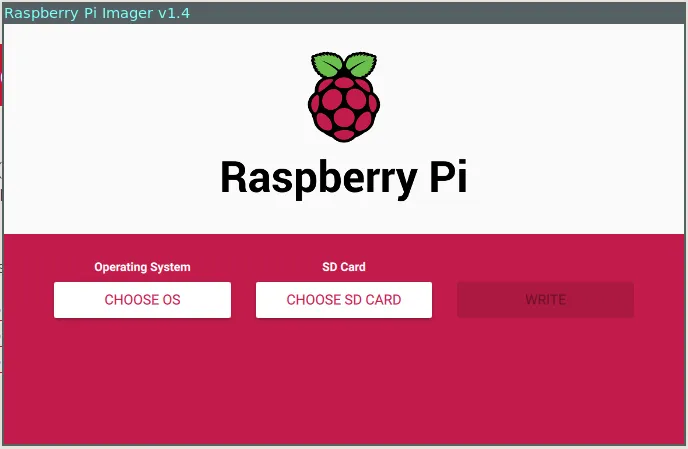
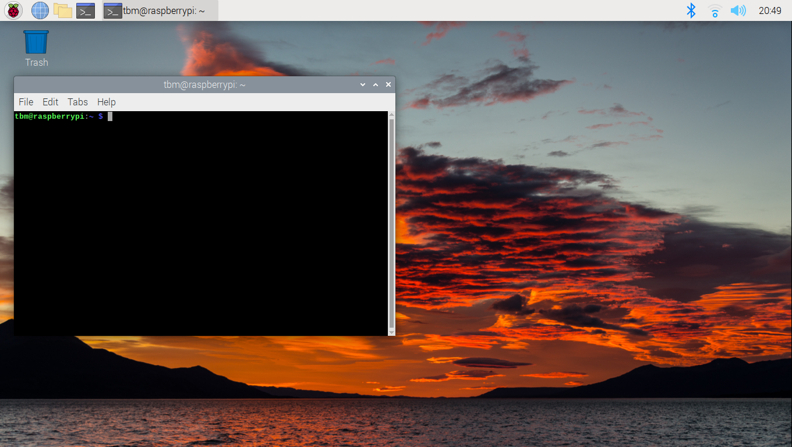

# Install a RaspbianOS

1. To install RPI go to https://www.raspberrypi.com/software/ and download RPI Imager.

2. Insert SD card into laptop and choose OS to install (you can also download OS directly from the same web page) and write SD card.
3. Insert SD card into Raspberry Pi, connect monitor, mouse and keyboard and turn it on.
4. Choose a keyboard layout and language of RaspbianOS, and click Next
5. Choose your username and password
6. Wait RPI to restart

- After restart your desktop looks like this
  

# SSH

You can go to https://www.raspberrypi.com/documentation/computers/remote-access.html#setting-up-an-ssh-server and enable ssh connection

- After enabling ssh you can ssh into your raspberry.
  

If you want to SSH into raspberry outside your LAN network, check my another tutorial [Port forwarding](https://github.com/mvisnjic/RPI-tutorials/tree/main/port-forwarding)
