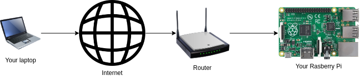
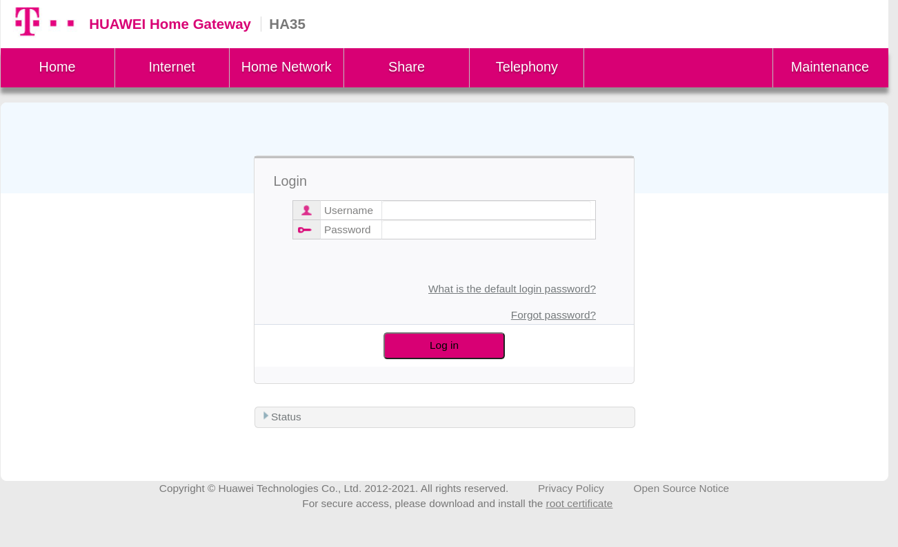
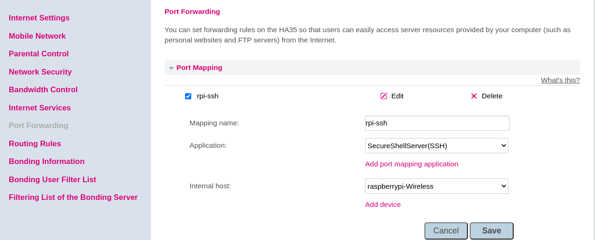
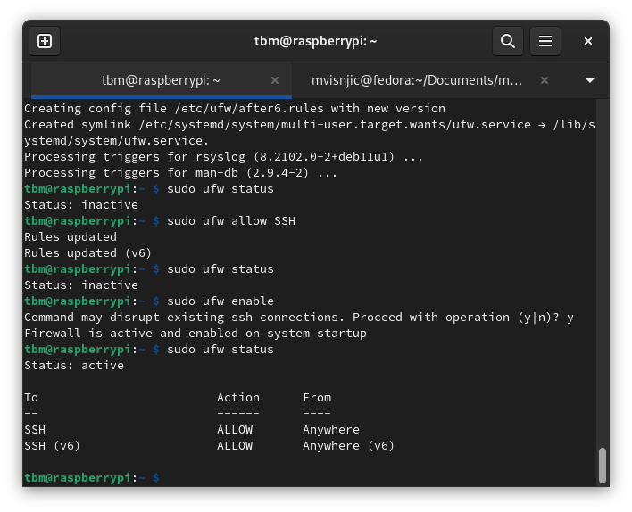
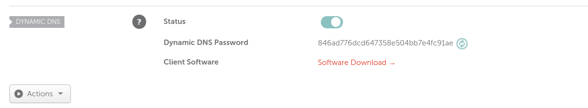
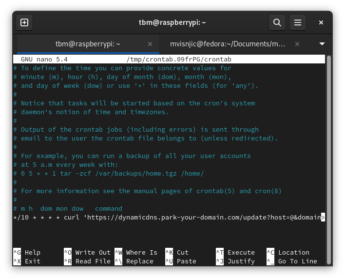
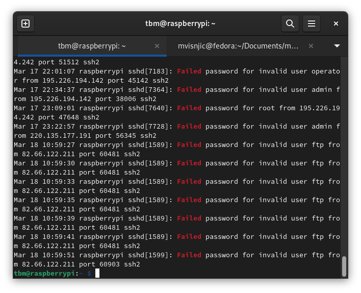

# Port forwarding

In short port forwarding is a NAT application that redirects requests from one address and port to another while the packets are traversing a router or a firewall.

---

1. Go to your home gateway (192.168.1.1)

2. Go to port-forwarding page and add new port maping application SSH (port 22) to a raspberry pi

3. Check here -[open ports checker](https://www.yougetsignal.com/tools/open-ports/) if is port 22 opened. If it's opened you can SSH into your raspberry through IP address of network where raspberry is connected.

- If port 22 aren't opened, you can install ufw: `sudo apt-get install ufw`

- `sudo ufw allow ssh`

- `sudo ufw enable`

- `sudo ufw status`

- You can buy a domain and configure it to point to your ip address of a Raspberry Pi. The problem is when a network provider change the ip address of a Raspberry Pi network. You need to set up a dynamic DNS which will update your IP to your domain provider. I'm using [namecheap.com](https://www.namecheap.com/) which has option to update your IP address with a HTTP request. Check [this](https://www.namecheap.com/support/knowledgebase/article.aspx/29/11/how-to-dynamically-update-the-hosts-ip-with-an-http-request/) article for more info.

---

# Dynamic DNS with namecheap.com

1. Log in into your namecheap account
2. Go to your domain
3. Go to advanced DNS and find dynamic DNS password
   

4. SSH into raspberry and add cron job to update an IP address. `crontab -e`
5. Paste this into crontab (but modify with your data): `*/10 * * * * curl 'curl 'https://dynamicdns.park-your-domain.com/update?host[host]&domain=[domain_name]&password=[ddns_password]&ip=[your_ip]' > ~/logs/dynamicdns.log`
   - automatic updating your IP address every 10 minutes
   

`*/10 * * * *` - "At every 10th minute" - [Crontab guru](https://crontab.guru/#*_*_*_*_*)

`curl 'https://dynamicdns.park-your-domain.com/update?host[host]&domain=[domain_name]&password=[ddns_password]&ip=[your_ip]'` - HTTP request to update your IP address on Namecheap

`> ~/logs/dynamicdns.log` - save response

- If you open your ports a lot of bots are try to brute force your raspberry. You can check your auth.log in `/var/log/auth.log | grep 'Failed'` and you can see how bots trying to connect to your raspberry pi. You can configure [google-authenticator](https://github.com/mvisnjic/RPI-tutorials/tree/main/setup-google-authenticator) to have more secured authentication and setup [fail2ban](https://github.com/mvisnjic/RPI-tutorials/tree/main/setup-fail2ban) to ban every IP that failed authentication.

`cat /var/log/auth.log | grep 'Failed'`

## 

> You have successfully open your ports. When ports are opened a lot bots and people trying to hack your RPI. Try this [fail2ban tutorial](https://github.com/mvisnjic/RPI-tutorials/tree/main/setup-fail2ban) to ban users who failed authentication, and I recommend to install [google-authenticator](https://github.com/mvisnjic/RPI-tutorials/tree/main/setup-google-authenticator).
> Check my other tutorials: [RPI-tutorials](https://github.com/mvisnjic/RPI-tutorials#readme)
