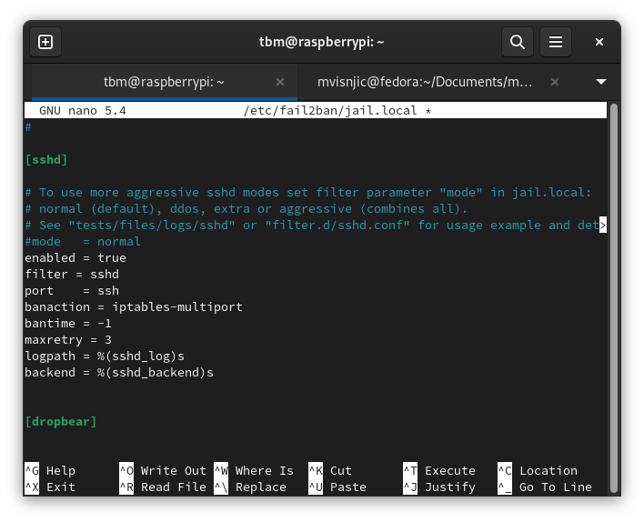
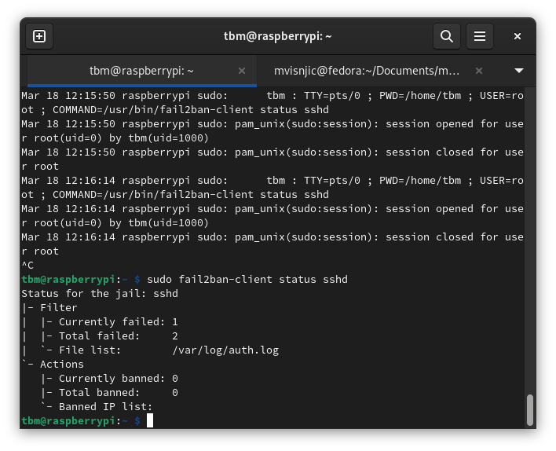
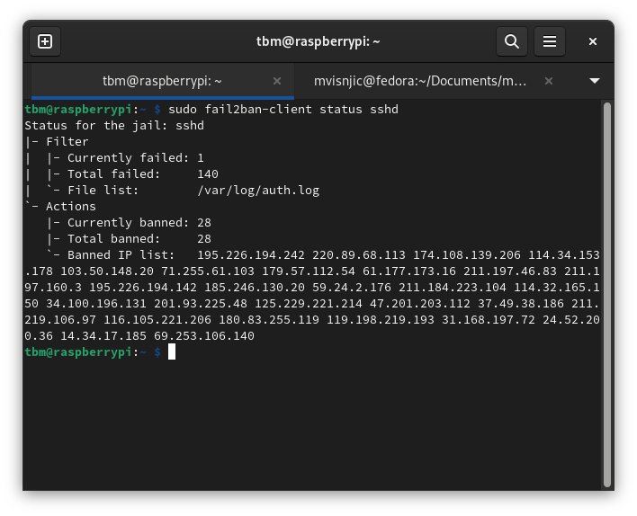

# Setup fail2ban on RPI

Fail2ban is a software that attempts to block and ban bots and users who trying to login into your Raspberry Pi.

---

# Installing

1. `sudo apt-get install fail2ban`
2. Copy jail.conf into jail.local `sudo cp /etc/fail2ban/jail.conf /etc/fail2ban/jail.local`
3. Open jail.local in nano `sudo nano /etc/fail2ban/jail.local`
4. With Ctrl+W you can search for [sshd] and add some parameters
   

   
   You can modify bantime and maxretry according to your needs.

5. Save changes and exit (Ctrl+x and y and hit enter)
6. `sudo service fail2ban restart`

- You can check `sudo fail2ban-client status sshd` and check banned IP addresses.

---

- After 24hours

> _This tutorial is based on [pimylifeup.com/raspberry-pi-fail2ban](https://pimylifeup.com/raspberry-pi-fail2ban/)._
> Check my other tutorials: [RPI-tutorials](https://github.com/mvisnjic/RPI-tutorials#readme)
