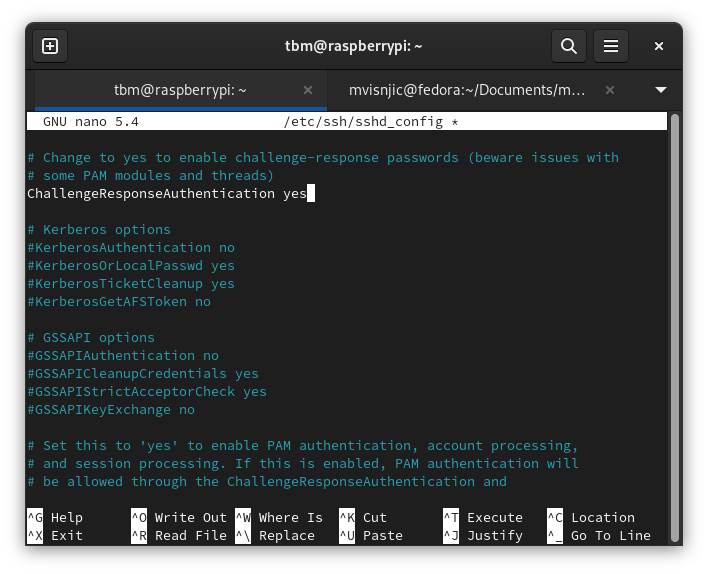
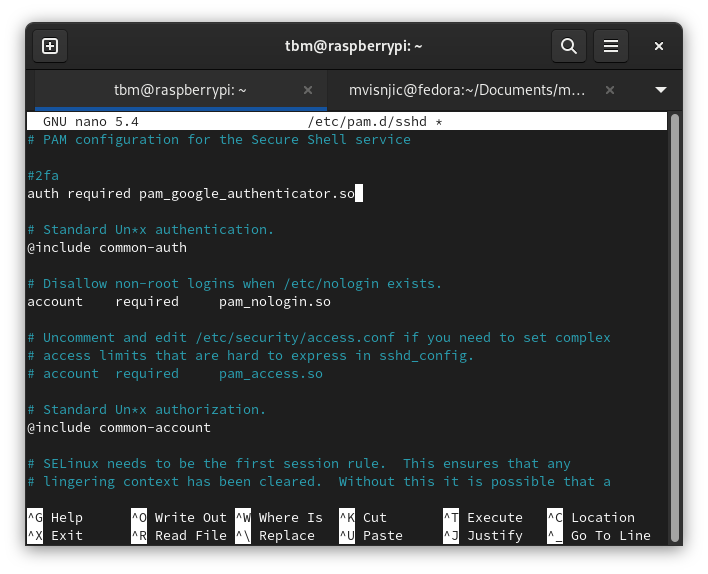
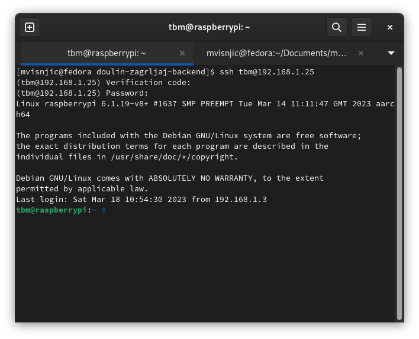

# Setup a google authenticator

---

1. Installing

   - `sudo apt-get install libpam-google-authenticator`

2. Configure sshd_config

   - `sudo nano /etc/ssh/sshd_config`
   - Find `ChallengeResponseAuthentication` and change to `yes`
   - Exit nano - Ctrl+x and y and hit enter

3. Open /etc/pam.d/sshd - [More about PAM](https://www.tecmint.com/configure-pam-in-centos-ubuntu-linux/)

   - `sudo nano /etc/pam.d/sshd`
   - Add 2fa above @include common-auth. You need to enter 2fa code first, then your password.
   - `auth required pam_google_authenticator.so`

4. And restart SSH
   - `sudo systemctl restart ssh`

---

Now when you configure these settings, you can type `google-authenticator` and follow on screen instruction.

- [x] Time-based tokens - `y`
  1.  Scan QR code or secret key in google authenticator app
  2.  Enter a code from a google auth
  3.  Save your emergency codes on a safe place
- [x] Update your /home/pi/.google.authenticator file - `y`
- [x] Disallowing multiple uses of same token - `y`
- [ ] Poor synchronization adjustment - `n`
- [x] Limit to 3 logins per 30 seconds - `y`

---

- Try if it works

> You have successfully setup a google-auth. I recommend you to setup a fail2ban - [fail2ban tutorial](https://github.com/mvisnjic/RPI-tutorials/tree/main/setup-fail2ban) or check my other tutorials: [RPI-tutorials](https://github.com/mvisnjic/RPI-tutorials#readme)
